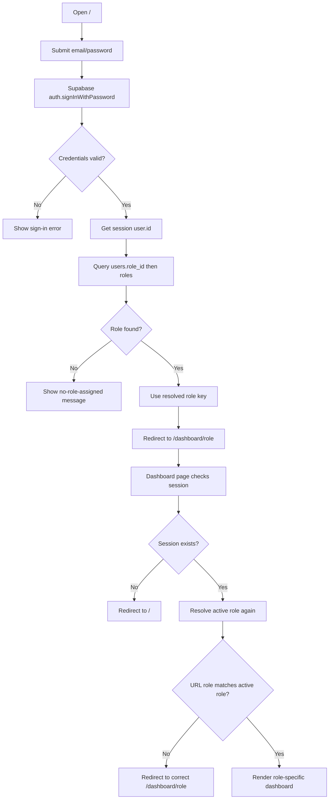

# Auth Login and Role Routing Flow

This document explains the current authentication and role-based dashboard routing flow implemented in the app.

## 1) Components Involved

- Sign-in page: `app/page.tsx`
- Supabase browser client: `lib/supabase/client.ts`
- Role lookup helper: `lib/auth/user-role.ts`
- Role definitions and priority: `lib/auth/roles.ts`
- Dashboard root redirect: `app/dashboard/page.tsx`
- Role dashboard page: `app/dashboard/[role]/page.tsx`

## 2) Data Sources

- Identity and credentials: `auth.users` (Supabase Auth)
- App profile: `public.users`
- Role assignment: `public.users.role_id`
- Role catalog: `public.roles`

## 3) Login Flow

1. User opens `/` and submits email/password.
2. App calls `supabase.auth.signInWithPassword(...)`.
3. Supabase validates credentials against `auth.users`.
4. On success, Supabase returns a session (JWT + refresh).
5. App reads `session.user.id`.
6. App fetches the role from `users.role_id -> roles`.
7. App validates the role key.
8. App redirects to `/dashboard/<role>`.

If no role is found:
- Login succeeds, but UI shows: `No role is assigned to this account. Contact admin.`

## 4) Dashboard Guard Flow

When user navigates to dashboard:

### `/dashboard`
1. Check session.
2. If no session, redirect to `/`.
3. Resolve user role.
4. Redirect to `/dashboard/<resolved-role>`.

### `/dashboard/[role]`
1. Check session.
2. If no session, redirect to `/`.
3. Resolve real active role from DB.
4. If URL role does not match real role, redirect to correct role route.
5. If matched, render role-specific dashboard UI.

## 5) Sign-Out Flow

1. User clicks `Sign out` on role dashboard.
2. App calls `supabase.auth.signOut()`.
3. Session is cleared.
4. User is redirected to `/`.

## 6) Role Behavior

Each user has exactly one role via `users.role_id`.

## 7) Mermaid Flow Diagram

## 8) Operational Notes

- Frontend role checks are UX-level.
- Supabase RLS should still enforce real data authorization.
- Never expose `SUPABASE_SERVICE_ROLE_KEY` in browser code.
- Browser uses only `NEXT_PUBLIC_SUPABASE_URL` and `NEXT_PUBLIC_SUPABASE_PUBLISHABLE_KEY`.
